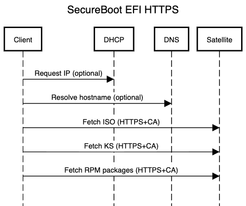

We live in a world where security is paramount, yet network provisioning is
often still done via the ancient PXE protocol, which is by design basically an
insecure remote execution. Hardware has moved on since the PXE times, and we
now have powerful BMC software with capabilities that are a great fit for a
secure, end-to-end network provisioning workflow.

This post describes a way to leverage the EFI firmware stack on Intel x86_64 to
do most of the security heavy lifting. What you will read was all tested on a
Fedora hypervisor running a Red Hat Satellite 6.18 VM (Katello 4.18), and the
installed host was a Red Hat Enterprise Linux 10.1 VM. This should also work in
other similar environments (e.g., ARM64 EFI) or with Linux distributions that
use the Anaconda installer.

Going forward, I will use the term "Satellite" to refer to Foreman, Katello, or
Red Hat Satellite deployments because they all function identically for this
use case. By "client" or "RHEL," I mean the Red Hat Enterprise Linux system
being installed, a clone, or any compatible Linux OS.

There are two layers of security relevant for our use case: TLS and SecureBoot.
While this article focuses on the former, everything was tested with SecureBoot
enabled and with an enrolled Microsoft key that is compatible with Red Hat
installation media and Anaconda. It is also possible to implement the secure
TLS workflow without SecureBoot.

While Satellite allows for the management of DNS and DHCP, this workflow
intentionally uses a network that is not subject to any management: no DHCP
`filename` options are required, and everything is direct and independent of
the network stack configuration. This means it will work on IPv6 networks or in
environments with static IP allocations — as long as the EFI firmware network
stack is configured correctly.

### Requirements

The workflow requires that the client hardware or hypervisor implements the EFI
specification version 2.5+, which includes several required features: UEFI HTTP
Boot, TLS support, and direct ISO boot. Let me explain all of them.

EFI firmware is usually PXE-capable, but it also implements the full HTTP
protocol. Thanks to UEFI HTTP Boot, operating systems or bootloaders can be
loaded via HTTP. This works both from PXE—when DHCP hands over a "filename"
option that is actually a URL plus the required specific HTTP headers — or
directly, where the HTTP address is configured in the firmware itself.

TLS support offers the use of HTTPS with both server and client validation. In
this article, I will cover server certificate validation using a CA
certificate, but this can be extrapolated to include client validation using a
certificate and a key. Before I describe what the direct ISO boot feature is
all about, let me mention why booting individual EFI files (Shim/Grub2) is not
used in this workflow.

The bootloader used in RHEL (Grub2) is a complex piece of code with its own
HTTP implementation. While it can use the EFI HTTP stack through its API, it is
not always reliable, as the EFI firmware is also a complex software and they
need to work in tandem. Test coverage of HTTP UEFI Booting in Grub2 is
primarily done in VMs.

With TLS, things are even more complex: when SecureBoot is turned on, the Shim
binary is loaded first to check SecureBoot, then it validates and loads Grub2,
which then loads the configuration file(s), and finally loads the kernel and
initramfs of the OS installer. That is a minimum of four additional HTTP
queries, meaning four more times the CA cert must be validated. Plus, Grub2
supports a scripting language, which presents a possible attack vector or a
higher chance for typos.

Furthermore, all of this requires active management of the boot files: Shim,
Grub2, configuration files, kernel, and initramfs must all be the correct
versions for SecureBoot to work. While Satellite can help with a lot of it,
when it comes to high-security standards, there must be something better.

Luckily, EFI offers other modes of HTTP Boot operation: instead of booting EFI
files, it can boot ISOs directly. In this case the EFI firmware downloads an
entire ISO into memory and utilizes virtual CD-ROM emulation to boot the OS.
Grub2 loads normally as if it were booting from a regular CD, and everything
comes sealed in a single file: Shim, Grub2, configuration, kernel, and
initramfs. There are no extra HTTP requests and no worries about intermediate
TLS verification.

One downside is that the booted RHEL client must have extra memory to
accommodate the virtual CD, which in this workflow is the RHEL netboot ISO
(approx. 1 GB). This is the case both for VMs as well as for bare-metal
machines where BMC software typically uses the main memory for the emulation.
My rough estimation for RHEL (2 GB RAM required minimum) is that 4 GB RAM is
required at minimum.

In my workflow, direct ISO boot, EFI TLS, and EFI variables play an important
role. Instead of booting separate EFI files over HTTPS, the RHEL netboot ISO is
booted directly. Bare-metal systems provide BMC access through a web UI or API
(Redfish) to boot an ISO file just once. The Satellite CA cert must be enrolled
into the firmware; this can be done via BMC, Redfish, or from an installed OS,
and it is a one-time operation per Satellite deployment.

Booting an ISO does have one drawback, though: there is no configuration that
can be changed on the fly, and there is no kernel command line that can be
modified. In highly secured environments, this can be seen as an advantage
rather than a disadvantage, but it still needs to be solved.

Luckily, EFI offers another feature: EFI variables. These are configuration
options used to configure systems; the boot URL is one of them, and boot order
or TLS CA are other examples. EFI also allows for custom key-value pairs, which
are exposed to the running system via the Linux kernel.

The first variable for my proof-of-concept is called `SatelliteUrl` and is used
to construct the kickstart request. The second one is called `SatelliteCa` and
holds a copy of the TLS CA cert. When the ISO is being loaded from the same
host where Satellite (or a Capsule) resides, the information is already there
along with the TLS context, so why bother creating two new EFI variables?

Unfortunately, details about the EFI HTTP Boot process become inaccessible the
moment the Linux kernel takes over. Therefore, these variables must be
explicitly created, even though they appear to be copies of already provided
information. Since everything can be set via BMC APIs (e.g., Redfish), this can
be fully automatic and transparent to Satellite users.

### Proof of Concept

I used a Fedora host with libvirt to host the Satellite VM and the RHEL VM. The
first step was to put the CA TLS cert into the VM's EFI firmware. After
creating an EFI VM, I customized its domain configuration as follows:

```bash
virsh edit client
```

Add a new namespace and `qemu:commandline` element.

```xml
<domain type='kvm' xmlns:qemu='http://libvirt.org/schemas/domain/qemu/1.0'>
  <qemu:commandline>
    <qemu:arg value='-fw_cfg'/>
    <qemu:arg value='name=etc/edk2/https/cacerts,file=/etc/pki/ca-trust/extracted/edk2/cacerts.bin'/>
  </qemu:commandline>

...

</domain>
```

While there are perhaps better ways to do this, this approach adds selected CA
certificates from the host's system cert store as TLS CA certs for HTTPS EFI
booting. The next step was to download the Satellite CA certificate onto the
host. Since this is a chicken-and-egg problem and I use the HTTPS protocol, the
insecure flag must be used once. For production environments, make sure to
download from a secure source:

```bash
curl -k https://satellite.example.com/pub/katello-server-ca.crt \
    -o /etc/pki/ca-trust/source/anchors/katello-server-ca.crt

update-ca-trust
```

The next step is to set the `SatelliteUrl` and `SatelliteCa` variables. I am
using the standard Linux bootloader GUID
(`4a67b082-dadf-4749-83c6-35b4f4f02a26`), but I suggest generating your own
GUID — just make sure it never changes, because EFI variables are looked up by
both GUID and name.

```bash
openssl x509 -in katello-server-ca.crt -outform DER -out katello-server-ca.der
CA_HEX=$(cat katello-server-ca.der | hexdump -ve '1/1 "%.2x"')
URL_HEX=$(echo -n "https://satellite.example.com" | hexdump -ve '1/1 "%.2x"')
```

The format of the certificate is DER, which is slightly shorter, but it can be
any format readable by the OpenSSL command-line utility. The `virt-fw-vars`
utility from Fedora 43 package named `virt-firmware` expects a JSON file with
data formatted in hex:

```bash
cat <<EOF > vars.json
{
  "version": 2,
  "variables": [
    {
      "name": "SatelliteUrl",
      "guid": "4a67b082-dadf-4749-83c6-35b4f4f02a26",
      "attr": 7,
      "data": "$URL_HEX"
    },
    {
      "name": "SatelliteCa",
      "guid": "4a67b082-dadf-4749-83c6-35b4f4f02a26",
      "attr": 7,
      "data": "$CA_HEX"
    }
  ]
}
EOF
```

This command uploads the EFI variables and sets a one-time boot from the URL.
We will prepare the ISO file in a moment:

```bash
virt-fw-vars --inplace /var/lib/libvirt/qemu/nvram/client-efi_VARS.qcow2 \
  --set-json vars.json \
  --set-boot-uri https://satellite.example.com/pub/boot.iso
```

Keep in mind that "boot from URL" EFI feature is one-time only, unless
configured otherwise. Any subsequent boot of the client VM will boot from the
disk, so make sure to set it to boot from the URL every time the VM must be
reprovisioned:

```bash
virt-fw-vars --inplace /var/lib/libvirt/qemu/nvram/client-efi_VARS.qcow2 \
  --set-boot-uri https://satellite.example.com/pub/boot.iso
```

These variables can be set in a libvirt NVRAM template file as well, so every
new VM automatically gets them, but this is out of scope for this post because
the main focus is to have a workflow suitable for bare-metal.

### The catch

Let's move into the Satellite VM for now and prepare the `boot.iso`. We will be
customizing an existing RHEL netboot ISO, which can be downloaded from Red Hat
portal, using a tool from the package named `lorax`.

The core of the customization is injecting a static kickstart that extracts the
EFI variables and downloads the real kickstart from Satellite via HTTPS,
validating the CA cert. It also inserts the CA into the system bundle, which is
then picked up by Anaconda when downloading from HTTPS DNF repositories.

When downloading the kickstart from Satellite, the kickstart script sends its
primary interface MAC address as a URL parameter. Anaconda itself uses HTTP
headers, and this could be done as well, but I thought this was shorter. I must
say, this is a very simplified and naive implementation; I was aiming for the
minimum possible shell code to get this working.

```bash
%pre --interpreter=/usr/bin/bash
URL_VAR="/sys/firmware/efi/efivars/SatelliteUrl-4a67b082-dadf-4749-83c6-35b4f4f02a26"
CA_VAR="/sys/firmware/efi/efivars/SatelliteCa-4a67b082-dadf-4749-83c6-35b4f4f02a26"
TMP_CA="/tmp/uefi-ca.crt"
TMP_KS="/tmp/main.ks"

if [ -f "$CA_VAR" ]; then
    dd if="$CA_VAR" bs=1 skip=4 2>/dev/null | openssl x509 -inform DER -out "$TMP_CA"
    cp "$TMP_CA" /etc/pki/ca-trust/source/anchors/
    update-ca-trust
fi

DEV=$(ip route get 8.8.8.8 | grep -Po 'dev \K\S+' || ls -1 /sys/class/net/ | grep -v lo | head -n1)
MAC=$(cat /sys/class/net/$DEV/address)

if [ -f "$URL_VAR" ] && [ -f "$TMP_CA" ]; then
    SATELLITE_URL=$(dd if="$URL_VAR" bs=1 skip=4 2>/dev/null | tr -d '\0')
    curl -sS --cacert "$TMP_CA" "$SATELLITE_URL/unattended/provision?mac=$MAC" -o "$TMP_KS"
else
    echo "THIS SYSTEM DOES NOT HAVE REQUIRED EFI VARIABLES"
    sleep 1h && poweroff
fi
%end

%include /tmp/main.ks

```

It is worth noting a known limitation of Anaconda: if you dynamically download
and `%include` a kickstart file during the `%pre` phase, any `%pre` sections
defined within that downloaded kickstart will be completely ignored. This
happens because Anaconda has already passed the pre-installation parsing phase.
If anyone wants to use this in production, I would suggest rewriting this logic
into Python (which is present on RHEL installation ISOs) to robustly detect and
execute pre-sections in a subshell.

Before we proceed further, I must stress that this hack is something that
should have been a native feature in Anaconda. The ability to add a DER file
from an EFI variable (e.g., `AnacondaCa`) and to process additional Anaconda
options in the kernel command line format (e.g., `AnacondaOptions`) would mean
that the official netboot ISO could be used without any modifications. This
feature will also be useful for Unikernels if Fedora decides to ship
UKI-based installers, where there is also no kernel command line available.

Each RHEL version must use its own version of the netboot ISO, though. While a
RHEL 10.0 netboot might technically install RHEL 10.1 or vice versa, this is
not recommended. In practice, several netboot ISOs must be managed to install
various versions of RHEL.

In my case, I named the downloaded ISO file `rhel10-netboot.iso`. Therefore, to
generate `boot.iso` with this kickstart, I used this command:

```bash
mkksiso --ks boot.ks \
    --cmdline "ip=dhcp rd.neednet=1 inst.network=1 inst.text" \
    rhel10-netboot.iso /var/www/html/pub/boot.iso
```

Because Anaconda thinks it is booting from a CD-ROM, it does not initialize the
network by default. However, we need the network in order to download the real
kickstart in the `%pre` section. Also, Anaconda does not support switching
between GUI and text modes in the middle of `%pre`. This should explain all the
options being injected.

### Satellite

Before starting the VM, synchronize the RHEL kickstart and update repositories,
create a new host in Satellite, set the MAC address correctly, ensure domain
and subnet are selected, and make one additional change. By default, all
kickstart installations are performed from HTTP repositories, meaning Anaconda
downloads all packages unencrypted. But if we change this to HTTPS, since the
Satellite CA is already in the system bundle, Anaconda will handle this
securely for us.

To my knowledge, there is no option to switch from HTTP to HTTPS for kickstart
repositories globally, so I made a slight change in the "Kickstart default"
provisioning template and replaced the URL prefix:

```bash
url --url https://satellite.example.com/pulp/content/Org/Library/content/dist/rhel10/10.1/x86_64/baseos/kickstart/
repo --name RHEL10-AppStream --baseurl https://satellite.example.com/pulp/content/Org/Library/content/dist/rhel10/10.1/x86_64/appstream/kickstart/
```

One last bit of warning: on top of HTTPS and SecureBoot, there are RPM GPG keys
that add another layer of security. Unfortunately, Anaconda to this day does
not check GPG keys during installation by default. Enabling that is out of
scope for this blog post, but I just wanted to mention this open bug from 1999:
[https://bugzilla.redhat.com/show_bug.cgi?id=998](https://bugzilla.redhat.com/show_bug.cgi?id=998)

### Conclusion

Everything is all set now. This is the communication that happens during
provisioning after the VM is powered on:



```text
title SecureBoot EFI HTTPS
Client->DHCP: Request IP (optional)
Client->DNS: Resolve hostname (optional)
Client->Satellite: Fetch ISO (HTTPS+CA)
Client->Satellite: Fetch KS (HTTPS+CA)
Client->Satellite: Fetch RPM packages (HTTPS+CA)
```

All BMC operations are typically done over HTTPS as well, but I left them out
of the diagram. Also, all additional networking that happens inside the
Satellite kickstart is not in the diagram. This includes host registration,
which currently downloads the Satellite CA cert in an insecure way; this should
be changed to use the EFI variable as described above. In fact, all calls that
reach out to Satellite can use the CA cert.

As you can see, this is a vast simplification of traditional PXE network
booting. While this proof of concept was done in a VM, every EFI 2.5+ compliant
bare-metal system will work just as well. The simplicity comes with some cost,
though: Satellite does not currently allow any ISO file management, since they
are shipped via the Red Hat Portal rather than through DNF repos on the CDN.
The (hopefully temporary) hack of injecting the kickstart into ISO files is
also a bummer, I hope Anaconda engineers will have a chance to work on this at
some point.

While I no longer work on Satellite, there is a possibility of using a
different software project that I am contributing to: Red Hat Image Builder.
While technically Image Builder cannot currently build RHEL netboot ISOs, all
the underlying technology is there and the functionality be added. For those
who would prefer creating netboot ISOs on the fly from RPM files hosted by
Satellite, this is certainly an option. File us a ticket if you would be
interested in doing that instead of using `mkksiso`.

Congrats, you made it to the end. I hope this wasn't boring, and if you build a
similar workflow, send me an e-mail or get in touch in any way! Cheers.

_Special thanks to rjones and kraxel from Red Hat for helping me to figure out
the EDK2 variables._
